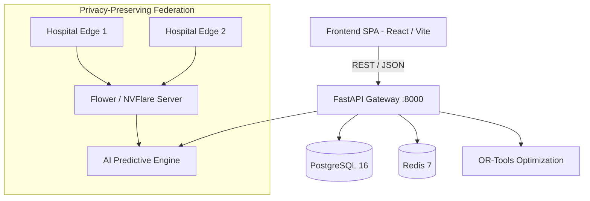

# Sanjeevani Grid

> **Health Resource Intelligence Platform**  
> Federated AI-powered Smart Health & Supply Chain Resilience Platform.

[](https://github.com/SanjeevaniGrid/Sanjeevani-Grid/actions/workflows/frontend-ci.yml)
[](https://github.com/SanjeevaniGrid/Sanjeevani-Grid/actions/workflows/backend-ci.yml)
[](https://github.com/SanjeevaniGrid/Sanjeevani-Grid/actions/workflows/project-check.yml)

---

## 1. Project Purpose

Healthcare systems frequently suffer from systemic resource mismatches: critical stockouts in rural centers occurring simultaneously with inventory expiration in urban hospitals, ambulance routing bottlenecks, and bed capacity overruns during regional disease outbreaks.

**Sanjeevani Grid** connects hospitals, clinics, and health authorities into an intelligent, decentralized mesh network. It forecasts demand, detects anomalies, balances stock, and optimizes logistics—all while preserving patient data confidentiality using Federated Learning and Differential Privacy.

---

## 2. Architecture Overview



---

## 3. Technology Stack

- **Frontend**: React 18, TypeScript, Vite, Tailwind CSS, React Router, TanStack Query, Zustand, React Hook Form, Zod, i18next
- **Backend**: FastAPI, Python 3.12+, SQLAlchemy 2.0 (Async), Alembic, PostgreSQL 16, Redis 7, Pydantic v2
- **AI & Predictive Modeling**: Scikit-Learn, PyTorch, XGBoost, LightGBM, MLflow
- **Federated Learning**: Flower / NVIDIA FLARE, Differential Privacy
- **Operations Research & Optimization**: Google OR-Tools (Linear/Integer Programming, VRP)
- **Infrastructure & DevOps**: Docker, Docker Compose, NGINX, Prometheus, Grafana, GitHub Actions

---

## 4. Repository Structure

```
Sanjeevani-Grid/
├── frontend/             # Single Page Application (React + Vite + Tailwind)
├── backend/              # Core API service (FastAPI + SQLAlchemy + PostgreSQL)
├── ai/                   # Machine learning pipelines & predictive models
├── federated/            # Federated learning coordinator & edge clients
├── optimization/         # Google OR-Tools solvers (redistribution, routing)
├── infra/                # Dockerfiles, NGINX config, and monitoring specs
├── docs/                 # Architecture, API standards, and database plans
├── scripts/              # Helper automation and verification scripts
├── .github/workflows/    # CI/CD pipelines
├── .gitignore            # Production-grade git ignore
├── .env.example          # Environment variables template
├── docker-compose.yml    # Root multi-container orchestration
├── Makefile              # Project lifecycle CLI targets
├── README.md             # Project documentation entrypoint
└── CONTRIBUTING.md       # Team workflow & branch guidelines
```

---

## 5. Prerequisites

- [Git](https://git-scm.com/)
- [Node.js](https://nodejs.org/) (v20+ recommended)
- [Python](https://www.python.org/) (v3.11 - v3.13)
- [Docker Desktop](https://www.docker.com/products/docker-desktop/) (for containerized execution)

---

## 6. Integrated development startup

Follow [DEVELOPMENT.md](DEVELOPMENT.md) for the verified PostgreSQL/PostGIS + Redis,
backend `.venv`, migrations, administrator bootstrap, frontend and worker commands.
The root Compose file is legacy scaffolding, not the supported integrated quickstart
or a staging deployment manifest. It lacks the verified PostGIS/auth configuration.

The architecture above describes the broader project direction. Current supported
frontend workflows and explicit unsupported capabilities are recorded in
[FINAL_READINESS_AUDIT.md](FINAL_READINESS_AUDIT.md) and the Phase 1?4 reports.

---

## 7. Local Standalone Setup

For the complete integrated setup use [DEVELOPMENT.md](DEVELOPMENT.md). The commands below are component-only references; database configuration and migrations are still required.

### Frontend
```bash
cd frontend
npm ci
npm run dev
```

### Backend
```bash
cd backend
python -m venv .venv
# Linux / macOS:
source .venv/bin/activate
# Windows PowerShell:
.venv\Scripts\Activate.ps1

python -c "import sys; from pathlib import Path; assert sys.prefix != sys.base_prefix and Path(sys.prefix).resolve() == Path('.venv').resolve()"
python -m pip install -r requirements.txt
python -m uvicorn app.main:app --reload --port 8000
```

---

## 8. Team Member Ownership

| Member | Branch | Primary Responsibility | Directory |
| :--- | :--- | :--- | :--- |
| **Member 1** | `frontend/member-1` | UI Components, State, Modules, Design | `frontend/` |
| **Member 2** | `backend/member-2` | Database Models, CRUD, Auth, Business API | `backend/` |
| **Member 3** | `ai/member-3` | Predictive Models, Demand & Bed Forecasts | `ai/` |
| **Member 4** | `infra/member-4` | Docker, NGINX, Federated AI, OR-Tools | `infra/`, `federated/`, `optimization/` |

---

## 9. Branch Strategy & Contribution Process

```
main (Production releases)
└── develop (Integration branch)
    ├── frontend/member-1
    ├── backend/member-2
    ├── ai/member-3
    └── infra/member-4
```

1. **Feature isolation**: Each team member develops strictly in their assigned branch.
2. **Pull Requests**: Never push directly to `develop` or `main`. Open a Pull Request targeting `develop`.
3. **CI Validation**: Ensure `npm run build` and `pytest` pass cleanly.
4. **Integration**: `develop` is validated before tagging releases into `main`.

See [CONTRIBUTING.md](CONTRIBUTING.md) for commit standards and detailed rules.
