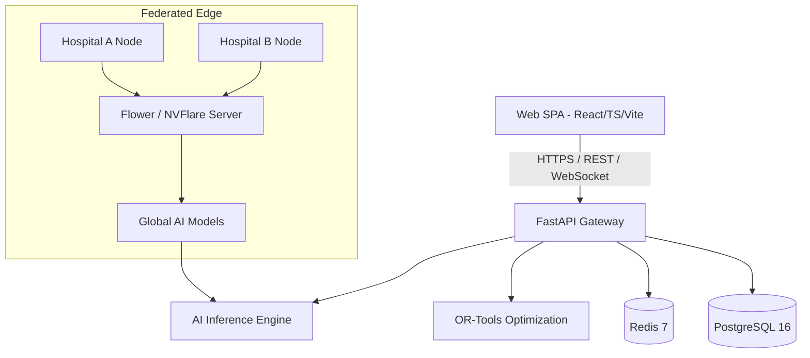

# Sanjeevani Grid - System Architecture

Sanjeevani Grid is a Federated AI-powered Smart Health & Supply Chain Resilience Platform designed to optimize healthcare resource allocation, predict supply shortages, and coordinate emergency responses without compromising patient data privacy.

## High-Level Topology

## Layer Separation

1. **Presentation Layer (`frontend/`)**: Modular React SPA with TanStack Query and Tailwind CSS.
2. **Application Layer (`backend/`)**: Asynchronous FastAPI service organizing business domains into clean repositories and services.
3. **Intelligence Layer (`ai/`)**: Scikit-Learn/PyTorch predictive models for demand, stockouts, patient influx, and anomaly detection.
4. **Decentralized Layer (`federated/`)**: Edge-aggregation architecture preserving hospital privacy boundaries.
5. **Operational Optimization Layer (`optimization/`)**: Google OR-Tools algorithms for vehicle routing and inventory rebalancing.
6. **Infrastructure Layer (`infra/`)**: Docker Compose, NGINX, and Prometheus observability stack.
